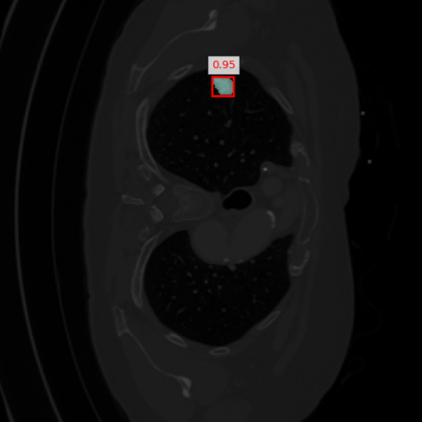
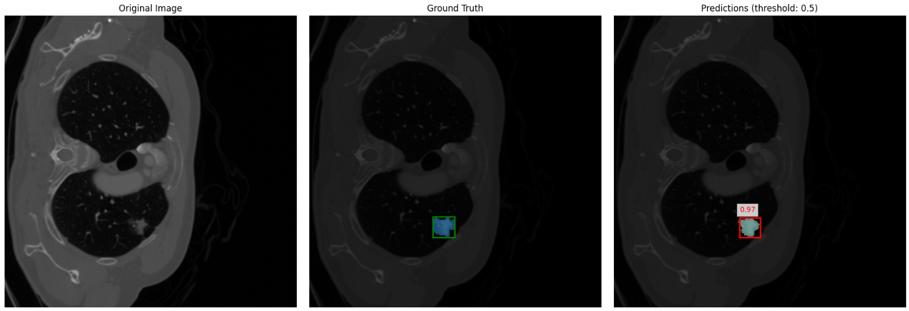

# 🫁 Lung Tumor Detection and Segmentation using Mask R-CNN



This repository contains a PyTorch implementation of **Mask R-CNN** for detecting and segmenting **lung tumors** in medical images. The model is capable of **bounding box detection** and **pixel-level segmentation** for tumors in CT scan slices.

---

## 🚀 Features

* ✅ Mask R-CNN with ResNet-50 backbone
* 🧠 Custom dataset class for lung tumor segmentation
* 🏋️‍♂️ Training and evaluation scripts
* 🖼️ Single-image visualization and inference
* 📊 Evaluation with Dice Score, Precision, Recall, and F1 Score

---

## 📁 Repository Structure

```
lung-tumor-detection-and-segmentation/
├── models/
│   ├── __init__.py
│   └── Mask_Rcnn.py               # Mask R-CNN model architecture
├── playground/
│   └── playground.ipynb           # Jupyter experiments
├── train/
│   ├── __init__.py
│   ├── config.py                  # Configuration settings
│   ├── evaluate.py                # Evaluation logic
│   ├── predict_inference.py       # Inference function
│   └── train.py                   # Training script
├── main.py                        # Run inference via CLI
├── requirements.txt               # Python dependencies
├── README.md
├── .gitignore
├── example_visualization.png      # Example visual output
├── image.png                      # Example prediction image
└── requirements.txt
```

---

## 🔧 Requirements

Install dependencies from the `requirements.txt` file:

```bash
pip install -r requirements.txt
```

Required libraries include:

* `torch`, `torchvision`
* `albumentations`
* `opencv-python`
* `matplotlib`
* `numpy`
* `tqdm`

---

## Training the Model

To train the Mask R-CNN model:

```bash
python train/train.py
```

You can configure:

* Batch size
* Epochs
* Learning rate
* Model save location

Modify these in `train/config.py`.

---

## 📈 Evaluation

To evaluate the trained model on the validation set:

```bash
python train/predict_inference.py
```

This will:

1. Load trained weights
2. Run predictions
3. Compute metrics (Precision, Recall, F1, Dice)
4. Visualize sample predictions

---

## 🖼️ Inference on a Single Image

You can run inference on a single image via code or command line.

### Option 1: Python Function

```python
from train.predict_inference import visualize_single_image_prediction

model_path = "weight/best_tumor_segmentation_model.pth"
image_path = "data/val/images/Subject_60/48.png"
visualize_single_image_prediction(model_path, image_path, score_threshold=0.5)
```

### Option 2: Command-Line Tool

```bash
python main.py --model-path weight/best_tumor_segmentation_model.pth --image-path data/val/images/Subject_60/48.png --score-threshold 0.9
```

---

## ✅ Results

| Metric     | Value |
| ---------- | ----- |
| Precision  | 0.83  |
| Recall     | 0.61  |
| F1 Score   | 0.70  |
| Dice Score | 0.70  |

---

## 📸 Example Visualizations



---

## 🙏 Acknowledgments

* Model: Based on [Torchvision’s Mask R-CNN](https://pytorch.org/vision/stable/models.html#id12)
* Dataset: Provided by [samamohamed29 on Kaggle](https://www.kaggle.com/datasets/samamohamed29/lungtumor)


